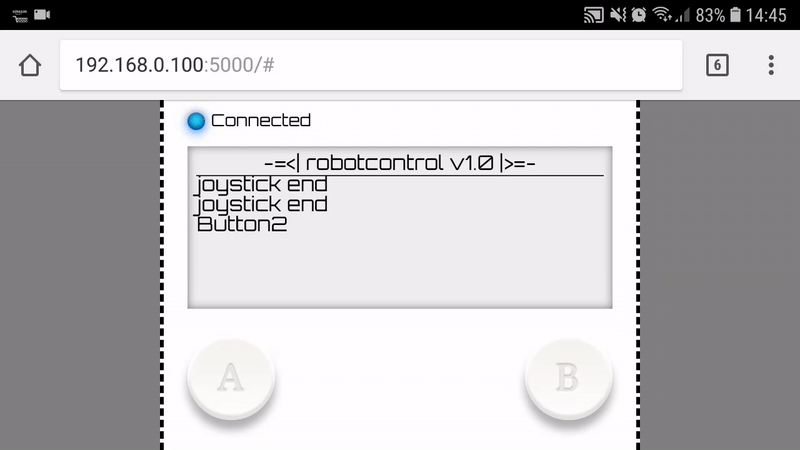

# RaspberryPi Robotcontrol

Interactive, low-latency javascript-based websocket-GUI for touch-devices
with a python-flask backend that interfaces to robotic components.
It provides virtual 2-axis joysticks (inspired by nipple.js but without the multitouch issues) and buttons
that all work simulatenously. Due to the two-way websocket connection, status-messages from the robot can be displayed in the text-area.



This software provides
* an interactive javascript low-latency websocket GUI served webpage
* a python-flask server that runs on a raspberry pi (or really any linux-machine)
* a two-way websocket connection for low latency control
* some server-side robot-classes (servo-, stepper-, toggle-control) that are already mapped to control inputs

_Important_: The GUI can currently only be controlled using touch-events, that means it should be used with a touchscreen device.

Tested on RaspberryPi 3 B+ with raspbian and Samsung Galaxy S7, Android 8, mobile google chrome 67.

## requirements
* python, numpy, flask

## howto run
* install necessary python-packages using pip ```pip install -r requirements.txt´´´
* run flask-server (server-websocket/main.py) -> this will provide the websocket API and serve the webpage on port 5000 
* call interface webpage in browser: http://server-ip:5000

## TODO
* unify control-interface to allow easier mapping of interface-axis/buttons to robot actions
